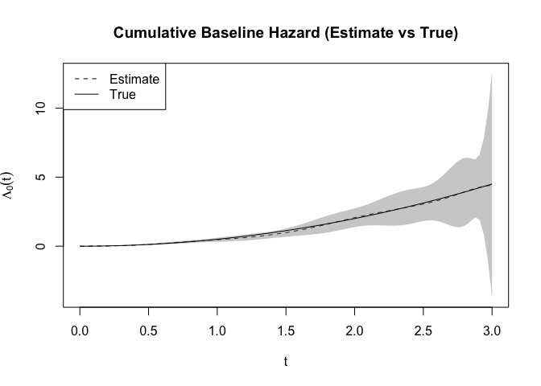

<!-- README.md is generated from README.Rmd. Please edit that file -->

# CoxStream

<!-- badges: start -->

[](https://lifecycle.r-lib.org/articles/stages.html#experimental)
[](https://CRAN.R-project.org/package=coxstream)
[](https://github.com/SignorinoY/coxstream/actions/workflows/R-CMD-check.yaml)
[](https://app.codecov.io/gh/SignorinoY/coxstream)
<!-- badges: end -->

The goal of coxstream is to …

## Installation

You can install the development version of coxstream like so:

``` r
# install.packages("pak")
pak::pak("SignorinoY/coxstream")
```

## Example

This is a basic example which shows you how to solve a common problem:

``` r
library(coxstream)
## basic example code
formula <- survival::Surv(time, status) ~ X1 + X2 + X3 + X4 + X5
fit <- coxstream(
  formula, sim[sim$batch_id == 1, ],
  degree = 4, boundary = c(0, 3), idx_col = "patient_id"
)
for (batch in 2:10) {
  fit <- update(fit, sim[sim$batch_id == batch, ])
}
summary(fit)
#> Call:
#> coxstream(formula = formula, data = sim[sim$batch_id == 1, ], 
#>     degree = 4, boundary = c(0, 3), idx_col = "patient_id")
#> 
#>       coef exp(coef)      se     z      p    
#> X1 1.00815   2.74053 0.05182 19.45 <2e-16 ***
#> X2 1.03193   2.80648 0.05404 19.09 <2e-16 ***
#> X3 1.03105   2.80399 0.05483 18.80 <2e-16 ***
#> X4 0.91369   2.49352 0.05238 17.44 <2e-16 ***
#> X5 1.04863   2.85375 0.05162 20.31 <2e-16 ***
#> ---
#> Signif. codes:  0 '***' 0.001 '**' 0.01 '*' 0.05 '.' 0.1 ' ' 1
#>    exp(coef) exp(-coef) lower .95 upper .95
#> X1 2.7405    0.3649     2.4759    3.0335   
#> X2 2.8065    0.3563     2.5244    3.1201   
#> X3 2.8040    0.3566     2.5183    3.1221   
#> X4 2.4935    0.4010     2.2502    2.7631   
#> X5 2.8538    0.3504     2.5792    3.1576
```

Besides the estimated coefficients, we can also obtain the estimated
baseline hazard function. The following code plots the estimated
cumulative baseline hazard function and the true cumulative baseline
hazard function.

``` r
time <- seq(0, 3, length.out = 100)
basehaz_pred <- basehaz(fit, time)
basehaz_true <- cbind(time, 0.5 * time^2)
plot(
  time, basehaz_pred[, 2],
  type = "l", lty = 2,
  ylim = range(basehaz_pred[, 4], basehaz_pred[, 5]),
  xlab = expression(t), ylab = expression(Lambda[0](t)),
  main = "Cumulative Baseline Hazard (Estimate vs True)"
)
polygon(
  c(time, rev(time)), c(basehaz_pred[, 4], rev(basehaz_pred[, 5])),
  col = rgb(0.5, 0.5, 0.5, 0.4), border = NA
)
lines(basehaz_true[, 1], basehaz_true[, 2])
legend("topleft", legend = c("Estimate", "True"), lty = c(2, 1))
```


